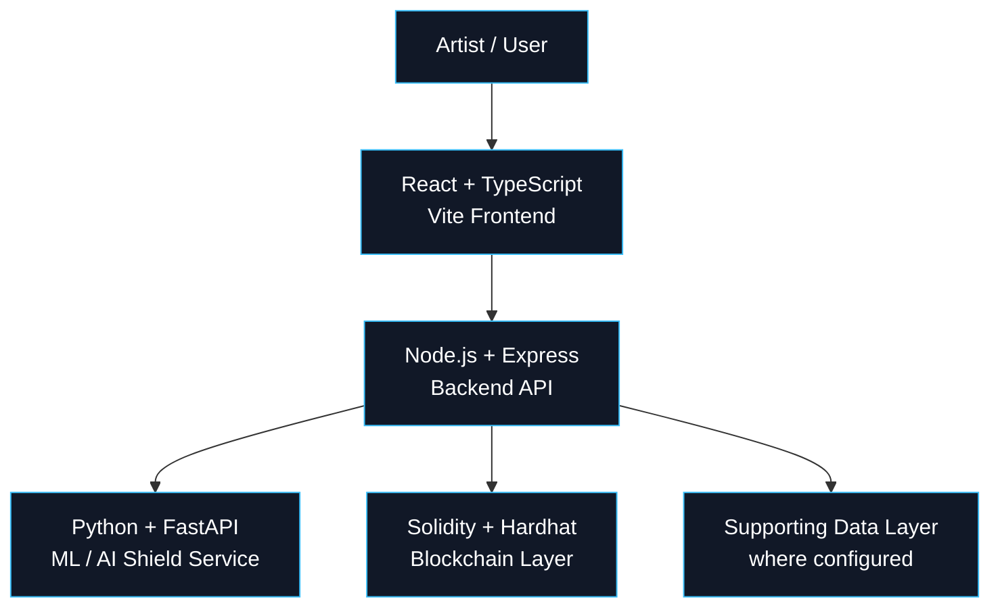

<div align="center">

# 🛡️ ARTSHIELD

### Protect the artifact. Prove the origin. Verify the evidence.

<p>
  <strong>Multi-Layer AI-Resistant Art Protection & Provenance System</strong>
</p>

<p>
  <a href="https://github.com/ADI2NOOB4U/ArtShield">
    
  </a>
  <a href="https://github.com/ADI2NOOB4U/ArtShield/network/members">
    
  </a>
  <a href="https://github.com/ADI2NOOB4U/ArtShield/blob/master/LICENSE">
    
  </a>
</p>

<p>
  
  
  
  
</p>

<p>
  <a href="https://github.com/ADI2NOOB4U/ArtShield">Repository</a>
  ·
  <a href="https://github.com/ADI2NOOB4U/ArtShield/issues">Issues</a>
  ·
  <a href="https://github.com/ADI2NOOB4U/ArtShield/stargazers">Star the project ⭐</a>
</p>

</div>

---

## ⚡ What is ArtShield?

**ArtShield is a defense-in-depth system for digital artwork.**

Digital art can be copied, modified, redistributed, scraped, or separated from its original creator. ArtShield explores a different approach: instead of relying on a single protection mechanism, it combines multiple layers of **identity, integrity, watermarking, AI-resistance research, provenance, certification, and rights evidence**.

The result is a workflow that can take an artwork from:

```text
ORIGINAL ARTWORK
       │
       ▼
┌──────────────────┐
│ ARTIFACT IDENTITY│  ← cryptographic fingerprint
└────────┬─────────┘
         ▼
┌──────────────────┐
│    WATERMARK     │  ← embedded payload
└────────┬─────────┘
         ▼
┌──────────────────┐
│    AI SHIELD     │  ← bounded perturbation research
└────────┬─────────┘
         ▼
┌──────────────────┐
│    INTEGRITY     │  ← SHA-256 evidence
└────────┬─────────┘
         ▼
┌──────────────────┐
│   PROVENANCE     │  ← artifact history
└────────┬─────────┘
         ▼
┌──────────────────┐
│   CERTIFICATE    │  ← blockchain-backed record
└────────┬─────────┘
         ▼
       VERIFY
```

> **Important:** ArtShield does not claim to make artwork impossible to copy or guarantee protection against every AI system or attack. The project demonstrates layered defensive and evidentiary techniques.

---

## 🎯 Why ArtShield?

| Layer | What it provides |
|---|---|
| 🔐 **Identity** | A cryptographic fingerprint for the artwork |
| 🧬 **Watermark** | An embedded payload associated with the protected artifact |
| 🛡️ **AI Shield** | Bounded adversarial perturbation research |
| 🔎 **Integrity** | SHA-256 based evidence for detecting changes |
| ⛓️ **Provenance** | A traceable artifact lifecycle |
| 📜 **Certificate** | Blockchain-backed certification in the configured environment |
| ⚖️ **Rights** | Rights issuance, verification and revocation |
| 🪪 **Passport** | A consolidated evidence-based artifact identity record |
| 👁️ **Sentinel** | A live security view of the selected artifact |

---

# 🧩 Core Features

<details>
<summary><strong>🔒 PROTECT — Build the shield</strong></summary>

- Artwork upload
- Cryptographic fingerprint generation
- SHA-256 integrity evidence
- Watermark payload processing
- AI Shield / bounded perturbation research layer
- Protected artifact generation
- Visual protection pipeline

</details>

<details>
<summary><strong>✅ VERIFY — Check the evidence</strong></summary>

- Artifact verification
- SHA-256 comparison
- Reference-based integrity verification
- Authentic / tampered states where supported by the evidence
- Verification workflow designed for exhibition demonstration

</details>

<details>
<summary><strong>📜 PROVE — Build the chain of evidence</strong></summary>

- Artifact Passport
- Provenance records
- Provenance graph
- Blockchain-backed certificate workflow
- Artwork registration
- Transfer / custody events

</details>

<details>
<summary><strong>⚖️ LICENSE — Control rights</strong></summary>

- Rights issuance
- Rights verification
- Rights revocation
- Rights-state evidence

</details>

<details>
<summary><strong>🧪 RESEARCH — Explore AI resistance</strong></summary>

- AI Shield research layer
- Bounded adversarial perturbation
- Defensive experimentation
- Attack simulation concepts where supported

> Research features are prototypes and should not be interpreted as universal AI protection.

</details>

---

# 🪪 Artifact Passport

The **Artifact Passport** is a portable, evidence-based identity record for a protected artwork.

It can consolidate information such as:

```text
ARTIFACT ID
TITLE
ARTIST
SHA-256 SEAL
FINGERPRINT
WATERMARK STATUS
AI SHIELD STATUS
INTEGRITY STATUS
PROVENANCE
RIGHTS
```

The important principle is that Passport information represents operations and evidence that actually exist. It is not intended to manufacture claims about an artifact.

---

# 👁️ Artifact Sentinel

**Artifact Sentinel** is ArtShield's signature security overview.

Instead of forcing a user to inspect every subsystem independently, Sentinel presents the state of the selected artifact across its major protection and evidence layers.

```text
                 ARTIFACT
                    │
        ┌───────────┼───────────┐
        ▼           ▼           ▼
     IDENTITY    WATERMARK   AI SHIELD
        │           │           │
        └───────────┼───────────┘
                    ▼
                INTEGRITY
                    │
                    ▼
               PROVENANCE
                    │
                    ▼
                  RIGHTS
```

A layer should only be shown as completed when the corresponding operation/evidence exists.

---

# 🏗️ Architecture



### Local development services

| Service | Local endpoint | Role |
|---|---|---|
| Frontend | `http://localhost:5173` | User interface |
| Backend | `http://localhost:3000` | API / orchestration |
| ML Service | `http://127.0.0.1:8000` | ML / AI Shield processing |
| Hardhat | `http://127.0.0.1:8545` | Local blockchain RPC |

---

# 🛠️ Tech Stack

| Layer | Technology | Role |
|---|---|---|
| Frontend | React + TypeScript | Interactive application UI |
| Frontend tooling | Vite | Development/build tooling |
| Styling | Tailwind CSS | UI styling system |
| Backend | Node.js + Express + TypeScript | API and orchestration |
| ML | Python + FastAPI | ML processing service |
| Image processing | NumPy + Pillow | Image analysis/manipulation |
| ML utilities | scikit-learn | Supporting ML functionality |
| Blockchain | Solidity | Smart contracts |
| Blockchain tooling | Hardhat | Local EVM development/deployment |
| Infrastructure | Docker | Supporting local infrastructure |
| Data | PostgreSQL / Redis | Supporting infrastructure where configured |

---

# 📁 Project Structure

```text
ArtShield/
│
├── frontend/          # React + TypeScript + Vite application
├── backend/           # Node.js + Express API
├── ml-service/        # Python + FastAPI ML service
├── blockchain/        # Solidity contracts + Hardhat tooling
├── database/          # Database-related resources
├── docker/            # Docker/supporting infrastructure
├── docs/              # Documentation and project material
├── scripts/           # Utility / automation scripts
│
├── .env.example       # Safe environment template
├── LICENSE
└── README.md
```

---

# 🚀 Installation

## 1. Prerequisites

Install:

- **Git**
- **Node.js + npm**
- **Python 3.11** for the ML service
- **Docker** if using the supporting infrastructure

> ⚠️ The ML environment should use Python 3.11. Newer Python versions can cause binary dependency compatibility problems with packages used by the ML stack.

---

## 2. Clone ArtShield

```bash
git clone https://github.com/ADI2NOOB4U/ArtShield.git
cd ArtShield
```

---

## 3. Environment configuration

Start from the provided example:

```bash
cp .env.example .env
```

On Windows PowerShell, you can use:

```powershell
Copy-Item .env.example .env
```

Fill in the required local values.

### Never commit secrets

Do **not** commit:

```text
.env
private keys
mutation tokens
ML service tokens
JWT secrets
session secrets
API secrets
```

Use `.env.example` only for safe placeholders.

---

# ▶️ Run ArtShield

ArtShield's local development environment uses several services.

## Terminal 1 — ML Service

```bash
cd ml-service
```

Create a Python 3.11 virtual environment:

### Windows

```powershell
py -3.11 -m venv .venv
.\.venv\Scripts\Activate.ps1
```

Install dependencies:

```bash
python -m pip install -r requirements.txt
```

Start FastAPI:

```bash
python -m uvicorn app.main:app --host 127.0.0.1 --port 8000 --reload
```

Expected:

```text
Uvicorn running on http://127.0.0.1:8000
```

---

## Terminal 2 — Local Blockchain

```bash
cd blockchain
npm install
npm run node
```

Expected RPC:

```text
http://127.0.0.1:8545
```

---

## Terminal 3 — Deploy Local Contracts

After the Hardhat node is running:

```bash
cd blockchain
npm run deploy:local
```

> ⚠️ A fresh local Hardhat node resets its local blockchain state. After restarting the node, redeploy the contracts before using blockchain-dependent features.

---

## Terminal 4 — Backend

```bash
cd backend
npm install
npm run dev
```

Expected:

```text
ArtShield backend listening on port 3000
```

---

## Terminal 5 — Frontend

```bash
cd frontend
npm install
npm run dev
```

Open:

**http://localhost:5173**

---

# 🖱️ One-Click Local Launcher

For Windows development, ArtShield can also be started with a batch launcher such as:

```text
ArtShield_Start_All.bat
```

The intended flow is:

```text
DOUBLE CLICK
     │
     ▼
ML SERVICE
     │
     ▼
HARDHAT BLOCKCHAIN
     │
     ▼
CONTRACT DEPLOYMENT
     │
     ▼
BACKEND
     │
     ▼
FRONTEND
     │
     ▼
BROWSER
```

This is a **local development convenience**, not a production deployment system.

---

# 🔌 API Reference

Known ArtShield API routes include:

| Method | Endpoint | Purpose |
|---|---|---|
| `POST` | `/api/protection` | Generate protected artifact |
| `POST` | `/api/verification` | Verify an artifact |
| `POST` | `/api/certificates` | Create certificate |
| `POST` | `/api/artworks/register` | Register artwork |
| `GET` | `/api/artworks/:fp` | Retrieve artwork |
| `GET` | `/api/artworks/:fp/provenance` | Retrieve provenance |
| `POST` | `/api/artworks/transfer` | Record transfer |
| `POST` | `/api/rights` | Issue rights |
| `GET` | `/api/rights/:id/verify?rightsMask=` | Verify rights |
| `POST` | `/api/rights/:id/revoke` | Revoke rights |

### Protection request

```json
{
  "imageBase64": "...",
  "watermark": "...",
  "metadata": {
    "title": "Example Artwork",
    "artist": "Example Artist"
  }
}
```

The protection workflow can return concepts including:

```text
fingerprint
watermark information
protected_image_base64
protected_artifact_hash
```

Exact request/response schemas should be treated as implementation details of the current API.

---

# 🔎 Verification Model

ArtShield uses cryptographic evidence together with a **reference-based verification model**.

The important distinction is:

```text
SOURCE ARTWORK
      │
      ▼
SOURCE FINGERPRINT
      │
      ▼
PROTECTED ARTIFACT
      │
      ▼
SHA-256 / INTEGRITY EVIDENCE
      │
      ▼
VERIFICATION REFERENCE
      │
      ▼
SUBMITTED ARTIFACT
      │
      ▼
COMPARE + VERIFY
```

This means ArtShield should not be described as magically embedding every proof into the artwork itself.

---

# ⛓️ Blockchain Layer

Blockchain is used as an evidence/provenance layer for workflows such as:

- Certificate records
- Artwork registration
- Provenance
- Transfer/custody events
- Rights records
- Verification/revocation workflows

The local development environment uses a **Hardhat EVM network**.

```text
Artist
  │
  ▼
ArtShield Backend
  │
  ▼
Smart Contract
  │
  ├── Certificate
  ├── Artwork
  ├── Provenance
  └── Rights
```

> The local Hardhat chain is for development and demonstration. It is not a production decentralized network.

---

# 🧠 AI Shield — Research Layer

ArtShield includes an **AI Shield research layer** exploring bounded adversarial perturbation and related defensive techniques.

The objective is to investigate whether carefully constrained modifications can reduce certain forms of automated AI processing or misuse while retaining practical artwork quality.

### Important limitations

AI Shield is:

- a research/prototype layer
- bounded rather than unlimited perturbation
- defensive experimentation
- not a universal AI blocker
- not a guarantee against every model or attack

AI systems and attack techniques evolve continuously, so no static protection method can honestly promise universal AI resistance.

---

# 🔐 Security Architecture

ArtShield follows a **defense-in-depth** philosophy.

```text
                    INTERNET
                       │
                       ▼
                 CDN / WAF
                       │
                       ▼
                DDoS Protection
                       │
                       ▼
                 Reverse Proxy
                       │
                       ▼
                 Rate Limiting
                       │
                       ▼
               ARTShield Backend
                  │         │
                  ▼         ▼
             ML Service   Blockchain
```

The application layer includes security mechanisms such as:

- Mutation authentication
- Role-based authorization
- Constant-time credential comparison
- Request/payload limits
- Rate limiting
- CORS restrictions
- Security headers
- Image format validation
- Image byte validation
- Pixel limits
- Decompression-bomb protection
- ML service authentication
- Server-side secret handling

> **No application should be described as "unhackable", "100% secure", or "DDoS-proof".** ArtShield uses layered protections, but production security depends heavily on deployment infrastructure.

---

# 🌐 Production Hardening

A local development server is not enough to safely expose an application directly to the public internet.

A production architecture should add:

```text
PUBLIC INTERNET
      │
      ▼
   CDN / WAF
      │
      ▼
DDoS MITIGATION
      │
      ▼
REVERSE PROXY
      │
      ▼
RATE LIMITING
      │
      ▼
ARTSHIELD API
   │        │
   ▼        ▼
PRIVATE ML  DATA / CHAIN
```

Additional production controls should include:

- managed secrets
- HTTPS/TLS
- centralized logging
- monitoring and alerting
- dependency vulnerability scanning
- hardened container/runtime configuration
- private networking for ML services
- production authentication/session management
- distributed rate limiting
- secure key management
- regular security testing

---

# 🆓 Is ArtShield Free?

### The short answer: the source code and local development can be used without paying for blockchain gas or a cloud provider.

| Category | Explanation |
|---|---|
| 🟢 **Source code** | Available under the repository license |
| 🟢 **Local development** | Can run using local services |
| 🟢 **Local blockchain** | Hardhat development chain requires no real gas |
| 🟡 **Cloud hosting** | May cost money |
| 🟡 **Managed databases** | May cost money |
| 🟡 **Third-party APIs** | May have their own pricing |
| 🟡 **Production ML compute** | Depends on infrastructure |

**Open source does not mean every production deployment is free.**

---

# 🎬 Exhibition Mode

ArtShield is designed to be understandable not only to developers but also to exhibition visitors.

The demonstration journey is:

```text
┌──────────┐
│  UPLOAD  │
└────┬─────┘
     ▼
┌──────────┐
│ PROTECT  │
└────┬─────┘
     ▼
┌──────────┐
│ VERIFY   │
└────┬─────┘
     ▼
┌──────────┐
│ PASSPORT │
└────┬─────┘
     ▼
┌──────────┐
│PROVENANCE│
└────┬─────┘
     ▼
┌──────────┐
│  RIGHTS  │
└──────────┘
```

The UI translates technical operations into a visual security experience.

---

# 🖥️ Interface

ArtShield's interface is intentionally designed around:

- cinematic scroll-driven interaction
- dark premium visual language
- digital-art gallery aesthetics
- subtle cybersecurity details
- 3D depth
- interactive protection stages
- artifact-centric dashboards
- visual security state

The goal is to make complex technical operations **feel understandable and inspectable**, rather than hiding them behind generic dashboards.

---

# 📸 Interface Preview

If screenshots are included in the repository, they can be presented here:

```text
docs/screenshots/
├── landing.png
├── protect.png
├── passport.png
└── verification.png
```

Example:

<p align="center">
  
</p>

> If these screenshot files are not present in your checkout, remove the corresponding image references from this section.

---

# 🧪 Testing

## Frontend

```bash
cd frontend
npm run typecheck
npm run lint
npm run build
```

## Backend

```bash
cd backend
npm test
```

## ML Service

```bash
cd ml-service
python -m unittest discover -s tests
```

## Blockchain

Check the available scripts:

```bash
cd blockchain
npm run
```

Then run the project's configured Hardhat test command.

---

# 🧯 Troubleshooting

<details>
<summary><strong>Port 5173 is already in use</strong></summary>

Another Vite process is already running.

On Windows PowerShell:

```powershell
Get-NetTCPConnection -LocalPort 5173 -ErrorAction SilentlyContinue
```

Stop the conflicting process or close the previous Vite terminal.

</details>

<details>
<summary><strong>503 ML service unavailable</strong></summary>

Check that the ML service is running:

```bash
python -m uvicorn app.main:app --host 127.0.0.1 --port 8000 --reload
```

Then verify that the backend can reach the configured ML service.

</details>

<details>
<summary><strong>Python dependency errors</strong></summary>

Use Python 3.11.

A clean environment is often the simplest fix:

```powershell
py -3.11 -m venv .venv
.\.venv\Scripts\Activate.ps1
python -m pip install -r requirements.txt
```

</details>

<details>
<summary><strong>401 Mutation authorization required</strong></summary>

The backend requires valid mutation authorization for protected write operations.

Check the local environment configuration and make sure the frontend/backend local development authentication path is configured correctly.

Never expose the mutation token in public source code.

</details>

<details>
<summary><strong>Blockchain is offline</strong></summary>

Start the local Hardhat node:

```bash
cd blockchain
npm run node
```

Then deploy the local contracts:

```bash
npm run deploy:local
```

Remember that restarting the local Hardhat node resets its state.

</details>

<details>
<summary><strong>Contract address mismatch</strong></summary>

Redeploy the contracts to the current local Hardhat network and ensure the application configuration points to the newly deployed addresses.

</details>

---

# 🗺️ Roadmap

### Completed / Demonstrated

- [x] Core protection pipeline
- [x] Cryptographic fingerprinting
- [x] SHA-256 integrity evidence
- [x] Watermarking
- [x] AI Shield research layer
- [x] Artifact verification
- [x] Blockchain prototype
- [x] Certificate workflow
- [x] Provenance workflow
- [x] Rights workflow
- [x] Artifact Passport
- [x] Artifact Sentinel
- [x] Exhibition-focused UI

### Future

- [ ] Production-grade authentication
- [ ] Production cloud deployment
- [ ] CDN / WAF integration
- [ ] Managed DDoS protection
- [ ] Centralized monitoring
- [ ] Stronger production key management
- [ ] Expanded AI attack research
- [ ] Scalable provenance infrastructure
- [ ] Production security audit

---

# ⚠️ Limitations

ArtShield is an engineering/research project and should be evaluated honestly.

- Local blockchain is primarily for development/demo.
- AI Shield is a research/prototype layer.
- Local exhibition authentication is not equivalent to production identity management.
- DDoS protection requires deployment infrastructure.
- Cloud infrastructure is not automatically included or free.
- Security controls reduce risk; they do not eliminate risk.
- AI resistance cannot be guaranteed against all models or future attacks.
- Verification depends on the evidence/reference model implemented by the system.

---

# 🤝 Contributing

Contributions are welcome.

```text
1. Fork the repository
2. Clone your fork
3. Create a feature branch
4. Make your changes
5. Run the relevant tests
6. Check lint/type errors
7. Open a Pull Request
```

Example:

```bash
git checkout -b feature/my-improvement
git add .
git commit -m "feat: improve artifact verification"
git push origin feature/my-improvement
```

Please keep security-sensitive changes documented and avoid committing secrets.

---

# 🛡️ Security Reporting

If you discover a security vulnerability:

1. Do not publish sensitive exploit details publicly.
2. Prefer GitHub's security reporting mechanisms where available.
3. Otherwise, use the repository's GitHub Issues responsibly for non-sensitive problems.

Never include:

```text
passwords
API keys
private keys
mutation tokens
ML tokens
session secrets
.env contents
```

in an issue or pull request.

---

# 📜 License

See the repository's [`LICENSE`](LICENSE) file for the applicable license.

---

# 👨‍💻 Project

**ArtShield** was built as a **B.Tech CSE project** exploring the intersection of:

```text
DIGITAL ART
     +
CYBERSECURITY
     +
CRYPTOGRAPHIC IDENTITY
     +
AI DEFENSE RESEARCH
     +
BLOCKCHAIN PROVENANCE
```

GitHub:

**https://github.com/ADI2NOOB4U/ArtShield**

---

<div align="center">

## Protect the artifact.

### Prove the origin.

### Verify the evidence.

<br>

⭐ **If you find the project interesting, consider starring the repository.**

<a href="https://github.com/ADI2NOOB4U/ArtShield/stargazers">
  
</a>

<br><br>

**Built for art. Engineered for evidence.**

</div>
